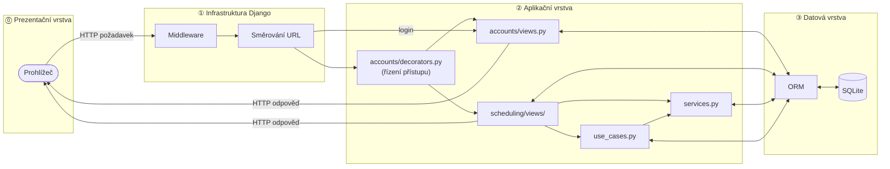

# Zjednodušené schéma zpracování HTTP požadavku

Schéma zobrazuje cestu HTTP požadavku přes tři architektonické vrstvy aplikace.
Řízení přístupu (dekorátory) je součástí aplikační vrstvy, nikoli samostatnou vrstvou —
v souladu s třívrstvým modelem popsaným v textu (prezentační / aplikační / datová vrstva).

---

## Описание слоёв

### ⓪ Prezentační vrstva — Prohlížeč (Презентационный слой)

Браузер — внешняя точка взаимодействия с системой. Инициирует HTTP-запросы
(GET — загрузка страниц, POST — изменение данных) и получает HTTP-ответы:
HTML-страницы, редиректы или JSON.
Клиентская часть (HTML-шаблоны и JavaScript) работает на этом уровне:
сервер рендерит шаблон и возвращает готовый HTML, JavaScript добавляет
интерактивность без перезагрузки страницы.
На схеме браузер выделен в отдельный блок (⓪), чтобы визуально обозначить
его как полноценный слой — наравне с инфраструктурным, прикладным и слоем данных.

---

### ① Infrastruktura Django (Инфраструктурный слой)

Слой обеспечивается фреймворком Django и не содержит прикладного кода проекта.

**Middleware** — цепочка обработчиков, через которую проходит каждый запрос
до попадания в view и каждый ответ на выходе. В проекте активны:
`SecurityMiddleware`, `SessionMiddleware`, `CommonMiddleware`,
`CsrfViewMiddleware`, `AuthenticationMiddleware`, `MessageMiddleware`,
`XFrameOptionsMiddleware`. Они обеспечивают сессии, аутентификацию пользователя,
CSRF-защиту, flash-сообщения и заголовки безопасности — прозрачно
для прикладного кода.

**Směrování URL (URL Routing)** — `shiftflow/urls.py` подключает маршруты
`accounts.urls` и `scheduling.urls`. Каждый входящий URL сопоставляется
с конкретной view-функцией. Именно здесь к view привязан декоратор:
он является обёрткой над функцией, а не отдельным middleware.

---

### ② Aplikační vrstva (Прикладной слой)

Содержит всю логику приложения: контроль доступа, обработку HTTP-запросов,
доменные проверки и бизнес-операции.

**accounts/decorators.py — řízení přístupu (Декораторы — контроль доступа)**
Параметризованный `role_required` формирует `manager_required` и `employee_required`.
Декоратор проверяет: аутентифицирован ли пользователь (иначе redirect на login),
имеет ли нужную роль (иначе redirect на свой интерфейс). Неаутентифицированный
запрос не доходит до view-функции. Декоратор не является отдельным архитектурным
слоем — он обёртка Python над view-функцией, объявленная декларативно.
Исключение — `login_view`: она не защищена кастомным декоратором и доступна
напрямую через URL-роутер, поскольку предназначена именно для неаутентифицированных
пользователей. На схеме это отражено отдельной стрелкой `URL → accounts/views.py (login)`.

**accounts/views.py**
Обрабатывает: вход/выход (`login_view`, `logout_view`), домашнюю страницу (`home`),
CRUD сотрудников (`manager_employees`, `manager_employees_create`,
`employee_update`, `reset_employee_password`, `employee_delete`). View-функции читают
и записывают данные напрямую через ORM. `use_cases.py` не используется —
операции с пользователями не требуют транзакционной координации нескольких таблиц.

**scheduling/views/**
Обрабатывает: страницы менеджера смен (`manager_shifts`, `save_shift`,
`delete_shift`, `publish_shift`, `publish_all_shifts`), страницы сотрудника
(`employee_shifts_view`, `employee_unavailability_toggle`), управление должностями
(`position_create`, `position_update`, `position_delete`). На GET-запросах
view делегирует чтение данных в `services.py` (`shifts_for_manager`,
`shifts_for_employee`) и рендерит шаблон. На POST-запросах
(`save_shift`, `publish_*`) view делегирует операцию в `use_cases.py`.
Прямой доступ к ORM используется только в операциях без бизнес-логики:
`delete_shift` и управление должностями (`position_create`, `position_update`,
`position_delete`).

**services.py**
Содержит два типа функций. Функции чтения — `shifts_for_manager()` и
`shifts_for_employee()` — формируют QuerySet смен с фильтрацией по периоду,
должности, статусу и недоукомплектованности; вызываются напрямую из
scheduling/views/ на GET-запросах. Функция записи — `assign_employees_to_shift()` —
выполняет четыре hard constraints последовательно: соответствие должности,
вместимость, недоступность, пересечение по времени; вызывается из `use_cases.py`
внутри `transaction.atomic()`.

**use_cases.py**
Координирует бизнес-операции изменения смен. Содержит три функции с разными
путями исполнения:

`save_shift()` — вызывает `ShiftForm` (валидация полей), затем делегирует в
`services.assign_employees_to_shift()` (hard constraints + синхронизация assignments)
внутри `transaction.atomic()`. Если любая проверка не прошла — вся операция
откатывается. Это единственная функция, которая вызывает `services.py`.

`publish_shift()` и `publish_shifts_in_period()` — обращаются к ORM напрямую
(`shift.save()`, `Shift.objects.filter().update()`), минуя `services.py`.

`forms.py` и `services.py` не вызывают друг друга и не знают об HTTP-запросе.

---

### ③ Datová vrstva (Слой данных)

**ORM (Django ORM)** — единственный способ доступа к данным в проекте.
QuerySet-запросы, `bulk_create`, `update` транслируются ORM в параметризованные
SQL-запросы.

**SQLite** — встраиваемая файловая СУБД. Хранит данные пяти таблиц:
`User`, `Position`, `Shift`, `Assignment`, `EmployeeUnavailability`.
Уникальные ограничения (`UniqueConstraint`) и каскады (`PROTECT`, `SET_NULL`)
заданы на уровне схемы и работают независимо от прикладного слоя.

---

## Сравнение с трёхслойной архитектурой

В тексте описаны три логических слоя приложения:

| Слой в тексте | Соответствие на схеме |
|---|---|
| Презентационный (шаблоны + JS) | ⓪ Prohlížeč — браузер рендерит HTML, JS добавляет интерактивность |
| Прикладной (views, forms, use-cases, services) | ② Aplikační vrstva целиком, включая декораторы |
| Слой данных (ORM + БД) | ③ Datová vrstva |

Инфраструктурный слой не входит в трёхслойную модель явно — он предоставляется
фреймворком Django и прозрачен для прикладного кода. На схеме он выделен отдельно,
чтобы показать полный путь HTTP-запроса, но архитектурно он не является прикладным слоем.
